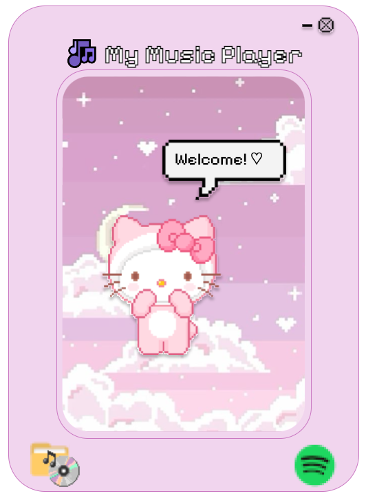
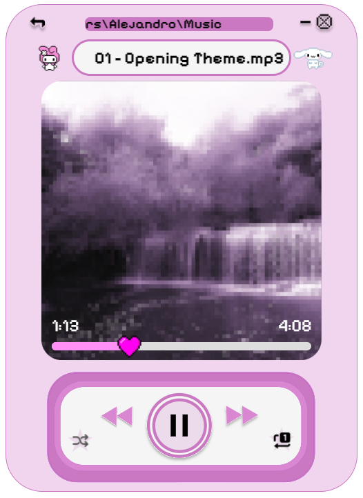

# ABAsic Music Player
A basic and nice music player.

<div>
    
    
</div>

Although it may seem so, the design was not made by me, but by my girlfriend.

---

# Plataforms

Currently, the application is only available for 64-bit Windows operating systems.

My machine (tested) is:
- **Operating System**: Microsoft Windows 10 Pro
- **OS Version**: 10.0.19045 N/D Build 19045
- **System Model**: ASUS TUF Dash F15 FX517ZE_FX517ZE
- **System Type**: x64-based PC
- **Processor**: Intel64 Family 6 Model 154 Stepping 3 GenuineIntel ~2300 MHz

# Usage

- Just download the installer [form here](https://github.com/agarnung/ABAsic-music-player/releases/download/v1.0.0/ABAsicMusicPlayerSetup.exe) and run it!

> [!NOTE]
> When the installation is complete, you should see a popup saying:
> 
> "Installation Complete. The app has been successfully installed!
> 
> Shortcuts have been created on the desktop and start menu.
> 
> You can delete the file `ABAsicMusicPlayerSetup.exe`."

> [!IMPORTANT]
> If you want to add different wallpapers, go to `C:\Users\<User>\AppData\Local\abasic-music-player\app-1.0.0\resources\wallpapers` (or a similar path) and just add the ones you want. You can use any common image format and size.

---

# Features

- If "back" is pressed and the song is more than 5 seconds ahead, it acts as a "reset this song" button. If it’s less than 5 seconds ahead, it goes back to the previous song. This way, we can forget about the "reset this song" button.

---

# Tools

- **Electron JS**: Used to build the application. While often criticized for memory footprint and performance, it provides an acceptable user experience for web developers.
- **Electron Forge**: Used to distribute the application once completed.
- **Pixelify Sans**: A variable font for greater flexibility, allowing adjustments to font weight (wght). [Link](https://gwfh.mranftl.com/fonts/pixelify-sans?subsets=latin) | [Variable Font](https://fonts.google.com/selection).
- **electron-icon-maker**: Used to create a custom `favicon.ico` for the app. [Tutorial](https://www.youtube.com/watch?v=dtk-v5vk8iA&ab_channel=tylerlaceby).

---

# Tutorial (for Developers)

The following tutorials were followed:
- [Electron JS Tutorials](https://www.electronjs.org/docs/latest/tutorial/tutorial-prerequisites) (A set of 6 tutorials on creating apps with Electron JS and prerequisites).
- [Installing Node.js on Windows](https://dev.to/arhamrumi/installing-nodejs-on-windows-a-complete-tutorial-3m6j).

We used Windows to program the application, with **VSCode** and [Git](https://git-scm.com/downloads/win).

Since we don’t like to work aimlessly, we use the tool `create-electron-app`, which simplifies some steps when creating our application:

```bash
npm install -g create-electron-app && create-electron-app ABAsic-music-player
```

- index.js: The entry point of the main process (Node). This file creates the unique main process used by the app under the Electron.js framework.

- index.html: The entry point for the front-end UI or render process (an instance of Chromium). There can be multiple render processes at the same time, but only one main process.

To launch the application in development mode, run from the CLI:
```
npm start
```

It’s worth mentioning that this isn’t equipped with "hot reloading," meaning changes to the code while the application is running won’t be reflected automatically. You’ll need to relaunch the application. However, you can run `rs` in the terminal where you ran `npm start`, and the app will reload without having to close it.

---

## How to Ship the App

To package the app for different OS (Windows, Linux, macOS), we use **Electron Forge**, which automatically handles this for us. The following command will detect the OS and build the distributable file:

```
npm run make
```

Now check the `out/` folder for the `.exe` (in the case of Windows), which you can distribute. Just marvelous ✨.

*Limitations*: Electron Forge can create a single installable EXE file for installation, but it cannot compile a single portable EXE due to Chromium’s limitations. However, alternatives like [electron-builder](https://www.electron.build/) can create portable executables.

## Packaging

### ZIP container 

You can use `npm run make`, which packages the application into a structure under `out/app-x64` with all the libraries and resources, including the `.exe` file. This is the zip file that you need to distribute to your friends to share the application.

**Instructions:**
1. Download the zip file.
2. Unzip it and move the entire `abasic-music-player-win32-x64` folder to `C:\Program Files` or your preferred directory.
3. Create a shortcut to the desktop (for example) pointing to the executable `abasic-music-player.exe`.
4. Run the application.

You can now enjoy your favorite music player!

### Installable executable

It’s necessary to install `electron-builder`:

```bash
npm install electron-builder --save-dev
```

`electron-builder` can be used to package your application into a single portable executable with an installer. After installing it, add the following script to your `package.json`:

```json
"scripts": {
  "dist": "electron-builder"
}
```

And run `npm run dist`.

### Portable executable

This configuration creates a single portable `.exe` that includes all dependencies in one file. After adding the previous script, run the following command:

```
"build": {
  "win": {
    "target": "portable"
  }
}
```

And run `npm run dist`.

### Electron Forge (our option)

If you already have `electron-forge` properly configured, the easiest approach is to remove `electron-builder` and use only Forge. Add to the `makers` group in `forge.config.js`:

```
name: '@electron-forge/maker-squirrel',
config: {
  "name": "abasic-music-player",
  "setupExe": "ABAsicMusicPlayerSetup.exe",
  "setupIcon": "assets/icons/favicon.ico",
  "noMsi": true,
  "loadingGif": "assets/loading.gif", // Replace electron forge's default GIF
  "portable": true,
  "createDesktopShortcut": true, // Create a desktop shortcut
  "createStartMenuShortcut": true // Optionally create a start menu shortcut
},
```

Then, simply run `npm run make` and the installer will be located at `C:\Users\Alejandro\Documents\Git\ABAsic-music-player\out\make\squirrel.windows\x64\ABAsicMusicPlayerSetup.exe` (or similar). This installer can be distributed, and when the user runs it, all dependencies will be automatically installed. In this case, it’s necessary to install `electron-squirrel-startup`:

```bash
npm install electron-squirrel-startup --save
```

### Other Options

- **AppImage**: A format for packaging and distributing Linux applications in a portable way.
- **Enigma Virtual Box**: A tool that can create a portable executable by compressing the application and its dependencies into one single file.
- **NSIS (Nullsoft Scriptable Install System)**: A script-driven installation system for creating Windows installers, offering great flexibility and customization.

These alternatives provide different ways to package and distribute an application across various platforms.

# Comments

- We discovered the useful CSS framework [Bulma](https://versions.bulma.io/0.7.0/documentation/overview/start/) for style development.

# References

- [Fireship - YouTube Video](https://www.youtube.com/watch?v=3yqDxhR2XxE&ab_channel=Fireship)
- [Nashallery - YouTube Channel](https://www.youtube.com/@nashallery)
- [StackOverflow - How to Create a Windows Executable with Electron Forge](https://stackoverflow.com/questions/78999493/how-to-create-a-windows-executable-with-electron-forge-that-adds-a-desktop-short)

# TODO

- Share the app with friends by clicking a button.
- Implement a dropdown in the song window to choose which song to play, in alphabetical order. Continue in that order if shuffle is not enabled.
- Button to repeat the current song in a loop.
- Move the Hello Kitty in the sky with the mouse when clicked, attached to her speech bubble.
- When the song is stopped, also stop the movement of the text above.
- Integrate YouTube (with an API like youtube-api-v3 or youtube-player).
- Connect to Spotify to play a playlist given its URL.

# References for Youtube API usage:

npm install ytpl play-dl

- https://medium.com/swlh/using-youtube-api-with-node-js-93e247c59786