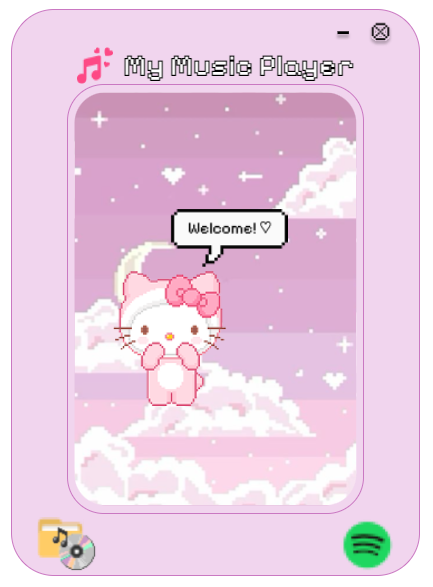
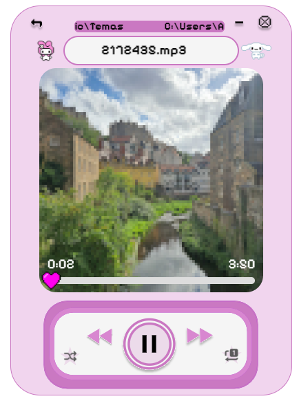

# ABAsic-music-player
A basic nice music player

<div>
    
    
</div>

Although it may seem so, the design was not made by me but by my girlfriend.

# Usage

Download [this zip](LINK), unzip it, and move the entire abasic-music-player-win32-x64 folder to C:\Program Files or your preferred path, then create a shortcut to the desktop (for example) of the executable abasic-music-player.exe, and run it. You can now enjoy your favorite music player!

If you want to add different wallpapers, go to `resources\wallpapers` and add whichever ones you want! You can use any common image format and any size.

## Features

- If "back" is pressed and the song is more than 5 seconds ahead, it acts as a "reset this song" button. If it’s less than 5 seconds ahead, it goes back to the previous song. This way, we can forget about the "reset this song" button.

# Tools

- We use Electron JS to build our application. It’s a commonly criticized alternative in terms of memory footprint and performance, but it is undeniable that for web developers, this is sometimes irrelevant, and the user experience provided by the framework is undeniably acceptable.
- We use Electron Forge to distribute our application once it’s completed.
- We use the variable font [Pixelify Sans](https://gwfh.mranftl.com/fonts/pixelify-sans?subsets=latin) [Variable Font](https://fonts.google.com/selection) for greater flexibility, allowing us to adjust the font weight (wght).
- We use [electron-icon-maker](https://www.npmjs.com/package/electron-icon-maker) to make our app use a custom favicon.ico. See https://www.youtube.com/watch?v=dtk-v5vk8iA&ab_channel=tylerlaceby.

# Tutorial (for developers)

The following tutorials were followed:
- https://www.electronjs.org/docs/latest/tutorial/tutorial-prerequisites (A set of 6 tutorials on creating apps with Electron JS and prerequisites)
- https://dev.to/arhamrumi/installing-nodejs-on-windows-a-complete-tutorial-3m6j (Installing Node.js)

We used Windows to program the application, with VSCode and [Git](https://git-scm.com/downloads/win).

Since we don’t like to work aimlessly, we use the tool create-electron-app, which makes some steps easier when creating our application:
bash
npm install -g create-electron-app && create-electron-app ABAsic-music-player


- The index.js is the entry point of our main process (Node). This file creates the (exactly) unique main process that the app uses under the Electron.js framework.
- The index.html is the entry point for our front-end UI or render process (which is an instance of Chromium). There can be multiple render processes at the same time, but only one main process.

To launch the application in development mode, run from the CLI:
bash
npm start


It’s worth mentioning that this isn’t equipped with "hot reloading," meaning if we make changes to the code while the application is running, they won’t be reflected automatically. We would need to relaunch the application (unlike what happens with web frameworks like Bundler/Jeckyll). However, you can run `rs` in the terminal where you ran `npm start` and the app will reload without having to close it.

How to ship our app? To package our app for different OS (Windows, Linux, MacOS), we can use Electron Forge, which automatically does all of this for us. The following command will detect our OS and build the distributable file for that OS:
npm run make

Now check the out/ folder for the .exe (in the case of Windows), which you can distribute to your friends. Just marvelous ✨.

Now, it’s important to note the limitations: Electron Forge can create a single EXE file for the purpose of installing the app on the user’s system, but what it cannot do (due to Chromium’s limitations) is, once installed, have only one EXE that launches the application. It must be accompanied by the necessary libraries. However, there are alternatives that can compile a portable Windows .exe using [electron-builder](https://www.electron.build/)'s portable target (NSIS) under the hood (see https://github.com/rabbit-hole-syndrome/electron-forge-maker-portable) (npm run make will run electron-forge make).

# Comments

- We discovered the useful CSS framework [Bulma](https://versions.bulma.io/0.7.0/documentation/overview/start/) for style development.

# References
- https://www.youtube.com/watch?v=3yqDxhR2XxE&ab_channel=Fireship
- https://www.youtube.com/@nashallery

# TODO 
- Share the app with friends by clicking a button.
- Implement a dropdown in the song window to choose which song to play, in alphabetical order. Continue in that order if shuffle is not enabled.
- Button to repeat the current song in a loop.
- Move the Hello Kitty in the sky with the mouse when clicked, attached to her speech bubble.
- When the song is stopped, also stop the movement of the text above.
- Integrate YouTube (with an API like youtube-api-v3 or youtube-player).

- Connect to Spotify to play a playlist given its URL.

To connect to Spotify and play a playlist, follow these steps: (https://chat.deepseek.com/a/chat/s/adff0462-079b-409b-8bf8-3868ea08af47)

Cuenta de Spotify Developer:
   Registra tu aplicación en [Spotify Developer Dashboard](https://developer.spotify.com/)
   En "Redirect URIs" agrega: http://localhost:3000/callback y your-app://callback. Mejor, en lugar de usar localhost, se puede utilizar un URI personalizado como protocolo (por ejemplo, myapp://callback) para manejar la redirección sin necesidad de un servidor local, pues esto es una aplicación de escritorio.
   Marca la casilla "Web Playback SDK"
   Guarda los cambios y copia tu Client ID (en Settings)

Deberá haber un modo de leer el token de spotify para usarlo y también de guardarlo y, naturalmente, de manejar los controles de spotify usando nuestra app GUI como "intermediario". Para esto se exponen esas funciones en `preload.js`.

Como es necesario especificar el clientId y el clientSecret, se usa `dotenv` para proporcionarlo al código de manera segura:
1. `npm install dotenv`
2. Crea un archivo `.env` en la raíz de tu proyecto y agrega tus credenciales:
```
SPOTIFY_CLIENT_ID=tu_client_id
SPOTIFY_CLIENT_SECRET=tu_client_secret
SPOTIFY_REDIRECT_URI=http://localhost:3000/callback
```
3. Ahora se puede acceder desde el index.js se manera segura:
```js
require('dotenv').config();
const SpotifyWebApi = require('spotify-web-api-node');

const spotifyApi = new SpotifyWebApi({
  clientId: process.env.SPOTIFY_CLIENT_ID,
  clientSecret: process.env.SPOTIFY_CLIENT_SECRET,
  redirectUri: process.env.SPOTIFY_REDIRECT_URI
});
```
4. Asegurarse de no subir el archivo `.env` a Github! Añadirlo al `.gitignore`.


Se emplea la libería `react-spotify-web-playback-sdk`. Instalar dependencias: `npm install react-spotify-web-playback-sdk spotify-web-api-node @react-oauth/google`.


